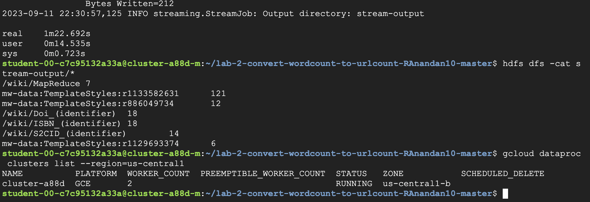
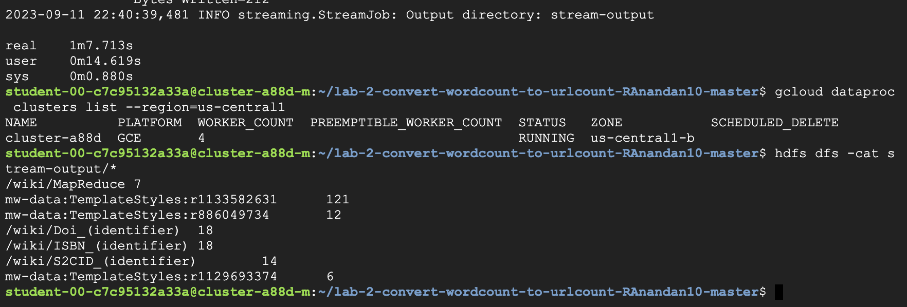

# Lab 2 - Convert WordCount to UrlCount Results

## Implementation Details
Implemented in Python -v3.10.8

### Packages used
Regular Expression package - re  

The urls are extracted from each line witth the help of the Regular Expression package.  
The pattern used for matching is r'href="([^"]*)"'.  
This pattern extracts urls from href="urls".  
Each url from this extraction is given a trivial count of 1.  
The Reducer function is similar to the WorCount program with a added constrain of unique url count greater than 5.  

## Dataproc Results

Hadoop version used - v3.3.3

The following are the results of running the URLCount program using the hadoop streaming service on 2 node and 4 node clusters on GCP Dataproc:  
#### Results for Master + 2 Worker node configuration 

#### Results for Master + 4 Worker node configuration 

### Execution times
2 Node cluster - 1m 22s  
4 Node cluster - 1m 7s  
The 4 node cluster perfoms slightly bettter than the 2 node cluster.  
This could be because we have more worker nodes to run the Mapper splits concurrently. This results in a faster execution of the Mapper process which is run in 10 splits.  

### Combiner 
Combiner process is run on the same node after the Mapper processes are run. The reason the Combiner processs cannot be used in the UrlCount program is because in the UrlCount program we have an addedd constrain of displaying thoses urls that appear more than 5 times.  The results from other Mapper processes have to be complete before we can get these results from other nodes. Since the Combiner process runs after a Mapper has finished on a node, the complete intermediate results are not available for the Combiner process. This would result in incorrect final results.
