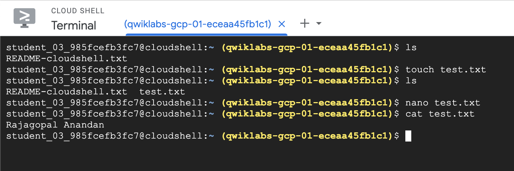

# Lab1 - Complete QwikLabs tour of Google Cloud Platform

You should access the Google Cloud Skills Boost Lab "A Tour of Google Cloud Hands-on Labs" overview at [https://www.cloudskillsboost.google/focuses/2794?parent=catalog](https://www.cloudskillsboost.google/focuses/2794?parent=catalog) .  Complete that.

Then, you'll complete another.  Note, you'll need to take a screen shot, so read the instructions below before starting and ending the next Google Cloud Skills Boost Lab, which is "Getting Started with Cloud Shell and gcloud" at [https://www.cloudskillsboost.google/focuses/563?parent=catalog](https://www.cloudskillsboost.google/focuses/563?parent=catalog) .   

Signing in with your colorado.edu address will show that credits have been shared with you.  This lab should be very easy -- you're basically following an online tutorial to learn how to use a software platform.

You should accept the assignment from Github Classroom ( https://classroom.github.com/a/5NtWLZB3 ) and follow the directions in the README.md in that assignment. You will hand in your assignment by adding a file to your github repository and the committing & pushing the changes.

In the gcloud shell edit a file called test.txt.  Write your name into that file.  Then, in the gcloud shell run "cat test.txt" and take a screen shot.  Add that image to the git repo.  You should name your image something like "lab1-finish-YOURNAME.png". You should then modify the README.md to display your image rather than the image provided.

You should complete that lab and then upload the screenshot, similar to the one below:

You should name your image something like
"lab1-finish-YOURNAME.png". You should then modify this README.md to
display your image rather than the image I provided. This will
evaluate your ability to:

* Complete the Qwiklab on using Google cloud
* Accepting a Github Classroom assignment
* Checkout out a Git repo
* Adding a file to the staging (`git add your-file-name.png`)
* Updating a Markdown file
* Commiting your changes (`git commit -a -m 'your message here'`)
* Pushing the changes to Github (`git push`)

